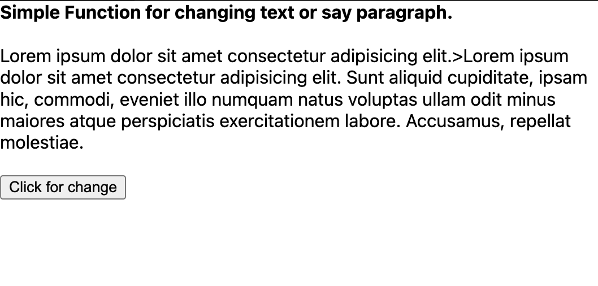
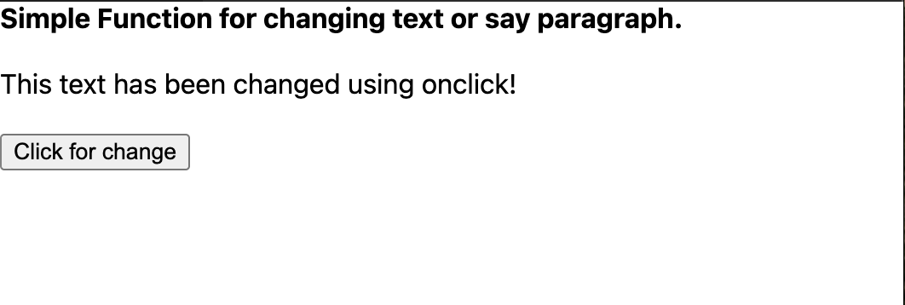

# Paragraph ChangeOnClick Task

## Task Overview

Make a HTML file and use JS for the functionality of changing paragraph using onclick function or event listener.

## Here is a screenshot of the output

## Before Clicking the button

## After Clicking the button

