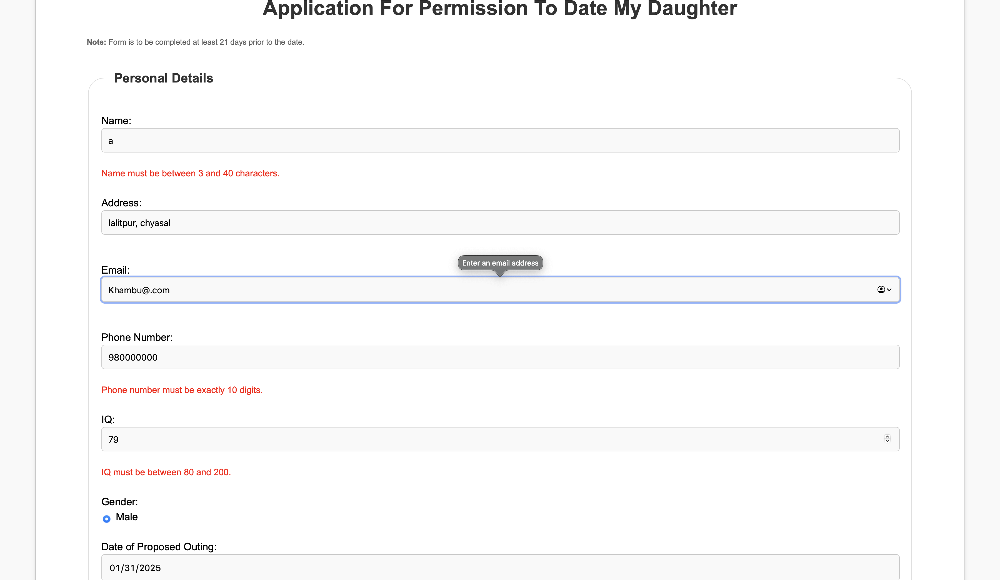
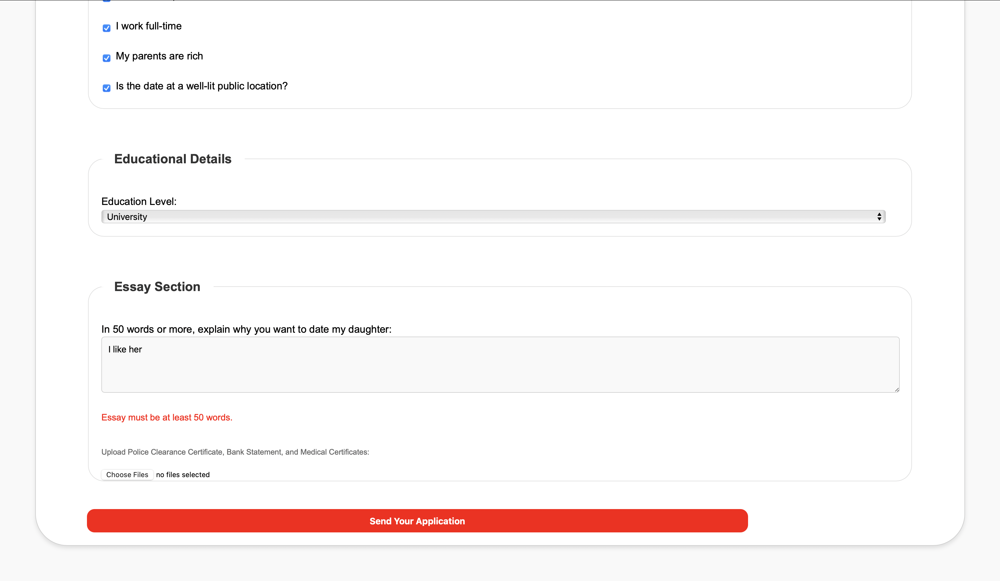
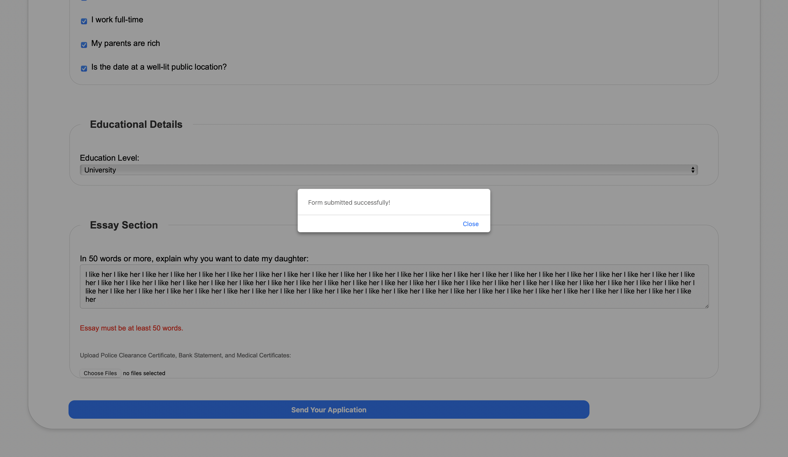

# Replica Form Task

## Task Overview

Replicating the existing Form Task as you would.

## Here is a screenshot of the output before entering data crudentials

## 1

## 2

## 3

## Here is screenshot of the output after entering data/ checking for validations

## 4

## 5

## After submitting the form

## 6

