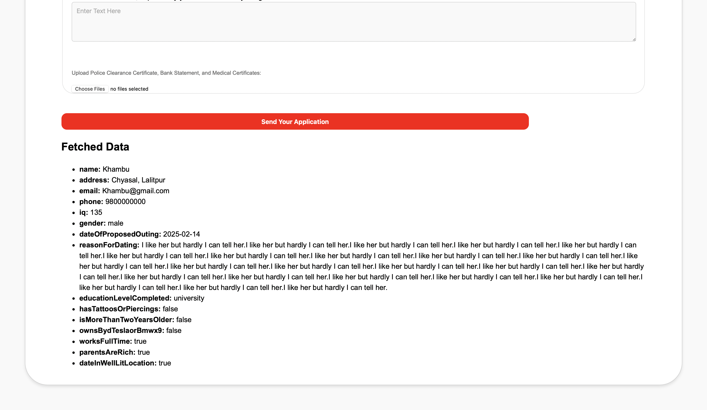

# API Task for getting data from form and displaying the results

## Task Overview

Using JSONBIN to store the results

## Here is a screenshot of the output displaying form data

## Before entering any data

The following is displayed in the browser.

## After entering some data

After submitting the form, the following is displayed in the browser.

